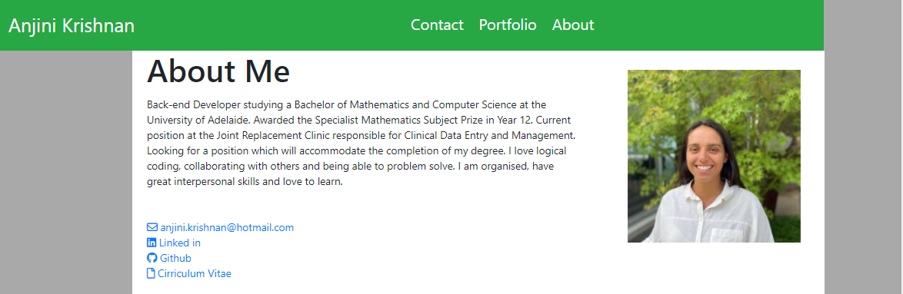
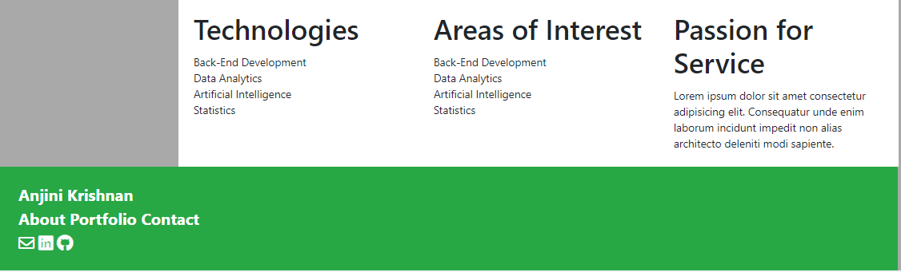
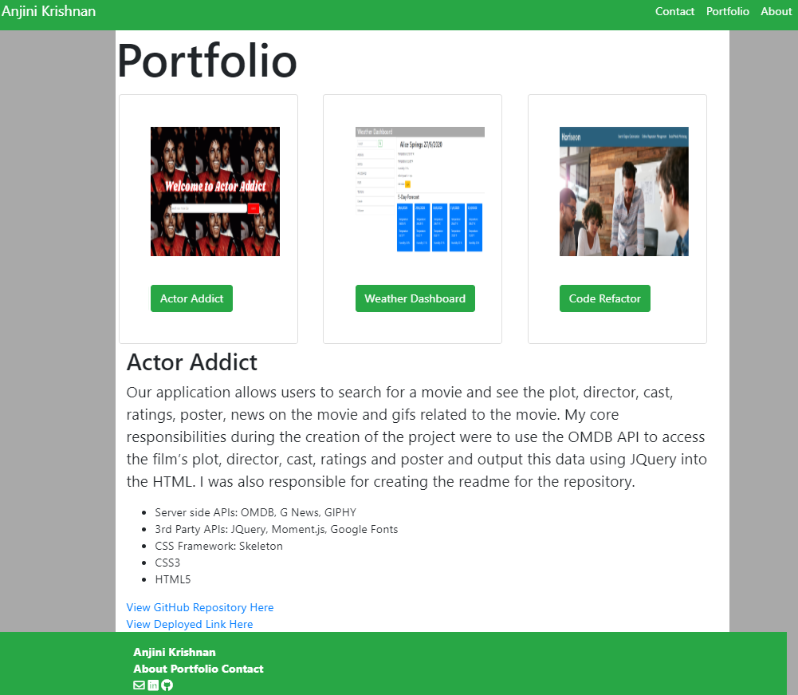
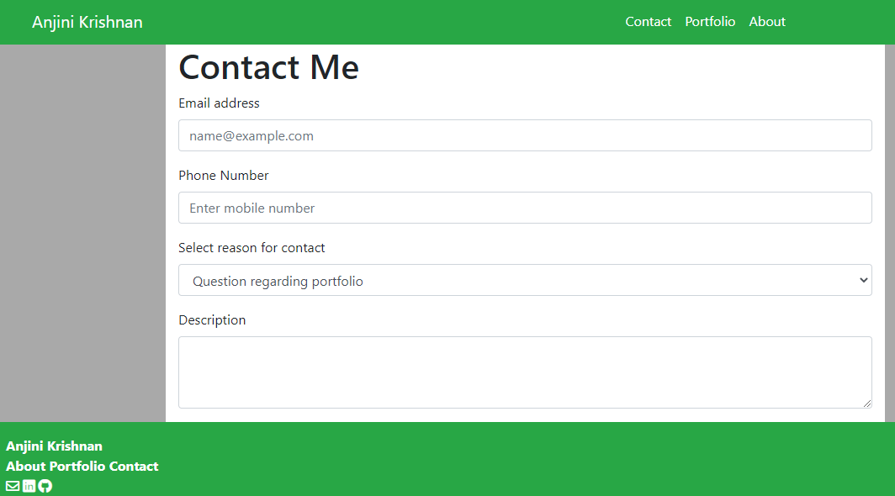

# Anjini Krishnan's Portfolio





* [View Portfolio Here](https://anjkrish2608.github.io/portfolio/)
* [View Github Repository Here](https://github.com/anjkrish2608/portfolio)


This project is a responsive website which consists of three separate webpages. Throughout the creation of this website the CSS Framework Bootsrap was used to create the navbar, grid layout, image responsiveness, cards and sticky footer. In the latest changes, a script.js file has been added so that a detailed description of each project in my portfolio can be accessed when the title is clicked. Finally the HTML was validated. The website displays a layout for a website which is filled with my permanent content except the Passion for Service field which will be included later on.

Throughout forming this website I faced many challenges. Firstly the challenge of the grid system on index.html, I struggled to create the sub-columns under the 'About Me' section - this was finally resolved due to poor row planning. This same issue later occured on portfolio.html when inputting the cards however this time it was easy to spot the issue and resolve it. Another issue I faced was the button function on the navbar however, thanks to Aman, this was easily resolved by linking to javascript and jQuery at the bottom of the body tag. 

Throughout numerous testings the design in total is fairly mobile responsive, this is most definitely a key area of improvement for the website however I am happy with the progress made so far. The text size was set to view port which I am confident about.

In the latest update I have changed the CSS color scheme to have matching green footer and header and a dark grey background color to emphasis the main sections for each page. Furthermore I was able to clean up the content in both the main and portolio page. I have also included some javascript on click event to display the details of each project which I am proud of too.

With the use of [W3Schools](https://www.w3schools.com) I was able to have a link for my email which would send the user to email me. The code I used is shown below and referenced [here](https://www.w3schools.com/tags/tag_address.asp).
```
<a href="mailto:webmaster@example.com">Jon Doe</a>
```
Overall I am happy with the improvements made however in the future I would like to further improve the following:
* Mobile Responsiveness
* Portfolio Project Cards remaining inside border
* Passion for Service text filled in

## Credits
Throughout the creation of this website the bootstrap documentation was heaviliy consulted. It was used to create the grid layout, the navbar, sticky footer, media querys' responsiveness and the cards. The suggested HTML from Trilogy was used as a template and changed in order to be responsive to media queries and viewport. [Font Awesome](https://fontawesome.com/) was used for all icons and [W3Schools](https://w3schools.com) was consulted for assistance.
The html was validated through **https://www.freeformatter.com/html-validator.html**. 
- - -
The tasksheet for this project was provided by Trilogy Education Services. 

© 2019 Trilogy Education Services, a 2U, Inc. brand. All Rights Reserved.


